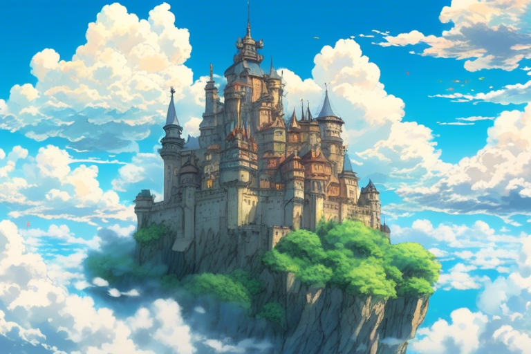

# Ghibli-AI-main

Turn your thoughts or photos into Studio Ghibli-style masterpieces using AI. Powered by **Stability AI**, **Spring Boot**, and **React**

---
## ✨ Features

- 🖼️ **Convert photos into Ghibli-style images using AI**
- 💬 **Enter a text prompt to generate unique Ghibli-style artwork**
- ⚙️ **Backend powered by Spring Boot**
- 🚀 **Deployed frontend on Netlify, backend on Render**
- 📥 **Preview and download your generated artwork**

---

## 📁 Project Structure

```

Ghibli-AI/
│
├── ghibliapi/               # Spring Boot Backend
│   ├── src/main/java/...    # Java backend logic
│   └── resources/
│       └── application.properties
│
├── ghibli-art-generator/    # React Frontend
│   ├── src/                 # Components & pages
│   └── public/              # Static assets

```

---

## 🌄 Screenshots

| Prompt                   | Ghibli AI Output                      |
| ------------------------ | ------------------------------------- |
| "Castle in the sky"      |        |

---

## 🧠 Tech Stack

| Frontend     | Backend        | AI Engine      | Deployment   |
| ------------ | -------------- | -------------- | ------------ |
| React (Vite) | Spring Boot    | Stability AI   | Netlify (FE) |
| Tailwind CSS | Feign Client   | (Text+Image)   | Render (BE)  |

---
